# Обзор и сравнение платформ для MCP (Model Context Protocol) серверов

## Содержание
- [Введение в MCP (Model Context Protocol)](#введение-в-mcp-model-context-protocol)
- [Категории платформ для MCP серверов](#категории-платформ-для-mcp-серверов)
- [Обзор ключевых платформ для MCP серверов](#обзор-ключевых-платформ-для-mcp-серверов)
  - [Фреймворки для разработки MCP серверов](#1-фреймворки-для-разработки-mcp-серверов)
  - [Реестры и каталоги MCP серверов](#2-реестры-и-каталоги-mcp-серверов)
  - [Хостинг-платформы для MCP серверов](#3-хостинг-платформы-для-mcp-серверов)
  - [Инструменты управления MCP серверами](#4-инструменты-управления-mcp-серверами)
- [Маркетплейсы и реестры MCP серверов](#маркетплейсы-и-реестры-mcp-серверов)
- [MCP серверы с поддержкой аутентификации](#mcp-серверы-с-поддержкой-аутентификации)
- [Сравнительная таблица платформ для MCP серверов](#сравнительная-таблица-платформ-для-mcp-серверов)
- [Популярные MCP-серверы и их сравнение](#популярные-mcp-серверы-и-их-сравнение)
- [Рекомендации по выбору платформы](#рекомендации-по-выбору-платформы)
- [Тенденции развития MCP платформ](#тенденции-развития-mcp-платформ)
- [Часто задаваемые вопросы о MCP платформах](#часто-задаваемые-вопросы-о-mcp-платформах)
- [Ресурсы для изучения MCP](#ресурсы-для-изучения-mcp)
- [Заключительные рекомендации](#заключительные-рекомендации)

## Введение в MCP (Model Context Protocol)

Model Context Protocol (MCP) – это открытый протокол, стандартизирующий взаимодействие между приложениями и языковыми моделями (LLM), такими как Claude от Anthropic. Представленный в конце 2024 года, MCP позволяет AI-ассистентам получать доступ к внешним данным, инструментам и API через стандартизированный интерфейс.

Образно говоря, MCP можно сравнить с USB-портом для ИИ-приложений. Он позволяет AI-моделям безопасно взаимодействовать с локальными и удаленными ресурсами – от файловой системы и баз данных до внешних API и сервисов.

MCP-серверы – это программы, которые реализуют протокол MCP и предоставляют инструменты, ресурсы и подсказки для AI-клиентов. Они могут давать доступ к различным источникам данных (файлы, документы, базы данных) и API, расширяя возможности ИИ-систем.

## Категории платформ для MCP серверов

На основе проведенного исследования можно выделить четыре основные категории платформ, связанных с MCP:

1. **Фреймворки для разработки** - библиотеки и инструменты для создания MCP серверов
2. **Реестры и каталоги** - платформы для поиска и установки готовых MCP серверов
3. **Хостинг-платформы** - сервисы для размещения и управления MCP серверами
4. **Инструменты управления** - приложения для установки и администрирования MCP серверов

## Обзор ключевых платформ для MCP серверов

### 1. Фреймворки для разработки MCP серверов

#### EasyMCP (TypeScript)

**EasyMCP** предлагает максимально простой подход к созданию MCP-серверов с минимумом кода. Разработчику не нужно заботиться о деталях реализации протокола.

**Ключевые особенности:**
- Express-подобный API для определения инструментов и ресурсов
- Автоматическое определение параметров с помощью декораторов
- Контекстный объект для логирования

**Плюсы:**
- Минимальный объем кода для запуска сервера
- Простой и понятный для разработчиков TypeScript
- Хорошая типизация для раннего обнаружения ошибок

**Минусы:**
- На начало 2025 года все еще в бета-версии
- Отсутствие поддержки некоторых продвинутых функций MCP
- Отсутствие явной системы плагинов или промежуточного ПО

**Идеально подходит для:** быстрого прототипирования, хакатонов, демонстраций или интеграции быстрых инструментов в ИИ-ассистента.

#### FastAPI-MCP (Python/FastAPI)

**FastAPI-MCP** – это расширение популярного веб-фреймворка FastAPI, автоматически экспортирующее существующие REST API-эндпоинты как MCP-инструменты.

**Ключевые особенности:**
- "Нулевая конфигурация" для интеграции с FastAPI
- Автоматическое обнаружение всех существующих API-эндпоинтов
- Повторное использование схем Pydantic для валидации входных данных

**Плюсы:**
- Исключительная простота для пользователей FastAPI
- Повторное использование аутентификации, middleware и обработки ошибок FastAPI
- Хорошая производительность благодаря асинхронности FastAPI/Uvicorn

**Минусы:**
- Полезно только если вы уже используете FastAPI
- Ограничен парадигмами FastAPI
- Автоматическое предоставление всех эндпоинтов может быть слишком разрешающим

**Идеально подходит для:** Python-разработчиков, которые хотят быстро интегрировать существующее API с ИИ-агентами без переписывания кода.

#### FastMCP (TypeScript)

**FastMCP** – полнофункциональный фреймворк для TypeScript с богатым набором готовых функций и простым API.

**Ключевые особенности:**
- Поддержка аутентификации, сессий пользователей, структурированного логирования
- SSE-стриминг, уведомления о прогрессе, поддержка сэмплирования
- CLI-инструмент для разработки и тестирования

**Плюсы:**
- Хороший баланс между простотой и мощностью
- Декларативный API для быстрого создания серверов
- Поддержка продвинутых функций MCP

**Минусы:**
- Более высокая кривая обучения из-за большого количества функций
- Наследует ограничения Node.js в плане производительности
- Требует понимания нескольких транспортных протоколов

**Идеально подходит для:** создания продакшн-серверов на TypeScript, которые могут потребовать потоковой передачи данных, многошаговых взаимодействий или сессий пользователей.

#### MCP-Framework (TypeScript)

**MCP-Framework** фокусируется на быстрой разработке с CLI для создания проектов и автоматическом обнаружении компонентов.

**Ключевые особенности:**
- CLI для создания проектов (`mcp create`)
- Автоматическое обнаружение инструментов/ресурсов из кода
- Поддержка множества транспортов (stdio, SSE, HTTP stream)

**Плюсы:**
- Очень быстрое начало работы благодаря CLI
- Минимум ручной конфигурации
- Активное сообщество с Discord-поддержкой

**Минусы:**
- Требует изучения соглашений фреймворка
- Дополнительный уровень абстракции над MCP SDK
- Средняя производительность (на основе Node.js)

**Идеально подходит для:** разработчиков, желающих быстро начать работу и создать хорошо структурированный проект с нуля.

#### Foxy Contexts (Golang)

**Foxy Contexts** – Go-библиотека с акцентом на производительность и декларативный подход к созданию MCP-серверов.

**Ключевые особенности:**
- Использование Uber Fx для внедрения зависимостей
- Поддержка как STDIO, так и SSE транспортов
- Пакет для тестирования (foxytest)

**Плюсы:**
- Высокая производительность и эффективность Go
- Чистое разделение компонентов благодаря DI
- Отличная масштабируемость

**Минусы:**
- Более высокая сложность по сравнению со скриптовыми языками
- Меньшее сообщество и меньше доступных материалов
- Требует опыта работы с Go и шаблонами DI

**Идеально подходит для:** приложений, требующих высокой производительности, команд с опытом Go, серверов с ожидаемой высокой нагрузкой.

### 2. Реестры и каталоги MCP серверов

#### Portkey.ai
[https://portkey.ai/mcp-servers](https://portkey.ai/mcp-servers)

**Portkey.ai** предлагает комплексную карту всех доступных MCP серверов, от эталонных реализаций до вкладов сообщества.

**Ключевые особенности:**
- Каталогизация MCP серверов по категориям
- Подробные описания и ссылки на репозитории
- Регулярные обновления для включения новых серверов

**Плюсы:**
- Хорошо структурированный и легкий для навигации интерфейс
- Комплексный обзор экосистемы MCP
- Включение как официальных, так и сторонних серверов

**Минусы:**
- Отсутствие возможности прямой установки серверов
- Ограниченная информация о совместимости и требованиях

**Идеально подходит для:** изучения доступных опций MCP серверов и выбора наиболее подходящей для конкретных нужд.

#### mcp-get.com
[https://mcp-get.com/](https://mcp-get.com/)

**mcp-get** – это реестр MCP серверов с возможностью поиска и инструментами командной строки для установки и управления.

**Ключевые особенности:**
- Поиск серверов с фильтрацией
- Инструмент командной строки для установки серверов
- Рейтинги и отзывы от сообщества

**Плюсы:**
- Прямая интеграция с инструментом установки
- Аналитика и статистика использования
- Активное сообщество пользователей

**Минусы:**
- Не такой обширный каталог, как у некоторых конкурентов
- Ограниченная поддержка некоторых операционных систем

**Идеально подходит для:** разработчиков, которые хотят быстро находить и устанавливать MCP серверы через командную строку.

#### mcp.so
[https://mcp.so/](https://mcp.so/)

**mcp.so** – обширный каталог MCP серверов с детальной документацией и инструкциями по установке.

**Ключевые особенности:**
- Обширная коллекция серверов (тысячи опций)
- Категоризация и теги для удобного поиска
- Подробные страницы серверов с примерами использования

**Плюсы:**
- Один из самых полных каталогов MCP серверов
- Активное сообщество и регулярные обновления
- Детальная документация для каждого сервера

**Минусы:**
- Отсутствие интегрированных инструментов для управления серверами
- Может быть сложно найти нужное из-за большого количества опций

**Идеально подходит для:** обнаружения специализированных MCP серверов для конкретных задач, изучения возможностей протокола MCP.

#### mcpm.sh
[https://mcpm.sh/](https://mcpm.sh/)

**mcpm.sh** (MCP Manager) – это открытый сервис и инструмент командной строки для управления MCP серверами в стиле Homebrew.

**Ключевые особенности:**
- Управление конфигурациями серверов через множество клиентов
- Автоматическое обновление серверов
- Роутер для подключения к множеству серверов

**Плюсы:**
- Простота установки и использования
- Управление зависимостями и версиями
- Поддержка как локальных, так и удаленных серверов

**Минусы:**
- Меньший каталог по сравнению с некоторыми альтернативами
- В первую очередь ориентирован на опытных пользователей командной строки

**Идеально подходит для:** разработчиков, которые хотят единообразно управлять несколькими MCP серверами в стиле пакетных менеджеров.

### 3. Хостинг-платформы для MCP серверов

#### mcp.run
[https://mcp.run/](https://mcp.run/)

**mcp.run** – это хостинг-платформа, предоставляющая реестр и контрольную плоскость для установки и запуска безопасных и переносимых MCP серверов.

**Ключевые особенности:**
- Централизованный хостинг MCP серверов
- Управление доступом и безопасностью
- Масштабирование и мониторинг

**Плюсы:**
- Упрощенное развертывание серверов
- Централизованное управление
- Обеспечение безопасности и изоляции

**Минусы:**
- Потенциальная зависимость от стороннего сервиса
- Возможные ограничения для настройки серверов

**Идеально подходит для:** организаций, которым требуется централизованное и безопасное развертывание MCP серверов без необходимости собственной инфраструктуры.

#### Composio
[https://mcp.composio.dev/](https://mcp.composio.dev/)

**Composio** предлагает более 100 управляемых MCP серверов с встроенной аутентификацией и простым подключением.

**Ключевые особенности:**
- Готовые к использованию управляемые MCP серверы
- Встроенная аутентификация и безопасность
- Бесшовное масштабирование

**Плюсы:**
- Устранение необходимости настройки серверов
- Высокая доступность и производительность
- Профессиональная поддержка

**Минусы:**
- Может быть дороже самостоятельного хостинга
- Ограниченный контроль над инфраструктурой

**Идеально подходит для:** предприятий и команд, которые нуждаются в быстром доступе к надежной инфраструктуре MCP без технических сложностей.

#### Cloudflare для MCP
[https://blog.cloudflare.com/remote-model-context-protocol-servers-mcp/](https://blog.cloudflare.com/remote-model-context-protocol-servers-mcp/)

**Cloudflare** предлагает возможность создания и развертывания удаленных MCP серверов с использованием своей инфраструктуры.

**Ключевые особенности:**
- Интеграция с Cloudflare Workers
- Глобальная сеть с низкой задержкой
- Безопасность и масштабируемость

**Плюсы:**
- Использование глобальной сети Cloudflare
- Интеграция с другими сервисами Cloudflare
- Высокая производительность и доступность

**Минусы:**
- Привязка к экосистеме Cloudflare
- Потенциально сложная настройка для новичков

**Идеально подходит для:** разработчиков, уже использующих Cloudflare, и команд, нуждающихся в глобально распределенных MCP серверах с высокой производительностью.

#### MCPServer.cloud
[https://mcpserver.cloud/](https://mcpserver.cloud/)

**MCPServer.cloud** - это хостинг-платформа, специализирующаяся на размещении и управлении MCP серверами в облаке.

**Ключевые особенности:**
- Быстрое развертывание MCP серверов в облаке
- Панель управления для мониторинга и контроля
- Высокодоступная инфраструктура

**Плюсы:**
- Простота масштабирования
- Отсутствие необходимости настройки собственной инфраструктуры
- Автоматические обновления

**Минусы:**
- Ограничения по возможностям кастомизации
- Потенциальная зависимость от провайдера

**Идеально подходит для:** команд, которым нужно быстро развернуть MCP сервер без погружения в детали инфраструктуры.

### 4. Инструменты управления MCP серверами

#### mcp-cli
[https://github.com/wong2/mcp-cli](https://github.com/wong2/mcp-cli)

**mcp-cli** – это инспектор командной строки для протокола MCP, позволяющий исследовать и отлаживать серверы.

**Ключевые особенности:**
- Интерактивный режим для тестирования серверов
- Поддержка различных транспортных протоколов
- Подробная информация о доступных инструментах и ресурсах

**Плюсы:**
- Удобно для разработки и отладки
- Простой в использовании интерфейс командной строки
- Поддержка расширенных функций MCP

**Минусы:**
- Ограниченная функциональность для массового управления
- В основном ориентирован на разработчиков

**Идеально подходит для:** разработчиков MCP серверов, которым нужен инструмент для тестирования и отладки.

#### MCPHub
[https://github.com/Jeamee/MCPHub-Desktop](https://github.com/Jeamee/MCPHub-Desktop)

**MCPHub** – это открытое приложение для macOS и Windows для обнаружения, установки и управления MCP серверами.

**Ключевые особенности:**
- Графический интерфейс для управления серверами
- Обнаружение и установка серверов
- Мониторинг статуса и журналов

**Плюсы:**
- Дружественный пользовательский интерфейс
- Упрощенное управление несколькими серверами
- Открытый исходный код

**Минусы:**
- Ограниченная поддержка некоторых специализированных серверов
- Меньше возможностей настройки по сравнению с CLI-инструментами

**Идеально подходит для:** пользователей, предпочитающих графический интерфейс для управления MCP серверами, и тех, кто новичок в экосистеме MCP.

#### mcp-guardian
[https://github.com/eqtylab/mcp-guardian](https://github.com/eqtylab/mcp-guardian)

**mcp-guardian** – GUI-приложение и инструменты для проксирования и управления MCP серверами.

**Ключевые особенности:**
- Централизованное управление доступом
- Проксирование запросов к серверам
- Мониторинг и логирование

**Плюсы:**
- Улучшенная безопасность и контроль
- Простое добавление и управление серверами
- Гибкая настройка

**Минусы:**
- Дополнительный уровень сложности
- Требует отдельной настройки

**Идеально подходит для:** организаций с высокими требованиями к безопасности и необходимостью централизованного контроля над MCP серверами.

## Маркетплейсы и реестры MCP серверов

### GitHub (modelcontextprotocol/servers)
[https://github.com/modelcontextprotocol/servers](https://github.com/modelcontextprotocol/servers)

**Официальный репозиторий MCP серверов** содержит эталонные реализации и ссылки на серверы, созданные сообществом.

**Ключевые особенности:**
- Эталонные реализации серверов для различных случаев использования
- Документация и рекомендации по реализации
- Поддержка от основных разработчиков протокола MCP

**Плюсы:**
- Официальный источник с высоким качеством кода
- Наиболее актуальные и соответствующие спецификации серверы
- Детальная документация и примеры

**Минусы:**
- Ориентирован на разработчиков, знакомых с GitHub
- Отсутствие централизованного GUI для управления

**Идеально подходит для:** разработчиков, желающих изучить эталонные реализации и следовать лучшим практикам.

### Glama.ai
[https://glama.ai/mcp/servers](https://glama.ai/mcp/servers)

**Glama.ai** предоставляет каталог готовых к использованию и экспериментальных MCP серверов с акцентом на расширение возможностей ИИ.

**Ключевые особенности:**
- Обширная коллекция серверов для различных задач
- Акцент на инновационные применения MCP
- Интеграция с другими сервисами Glama

**Плюсы:**
- Простой, хорошо организованный интерфейс
- Подробные описания возможностей каждого сервера
- Активное сообщество разработчиков

**Минусы:**
- Некоторые серверы могут быть экспериментальными
- Не все серверы имеют одинаково подробную документацию

**Идеально подходит для:** инноваторов, исследующих новые возможности взаимодействия ИИ с внешними данными и инструментами.

### Smithery.ai
[https://smithery.ai/](https://smithery.ai/)

**Smithery.ai** — реестр MCP серверов, помогающий найти подходящие инструменты для ИИ-агентов.

**Ключевые особенности:**
- Интеллектуальный поиск и рекомендации
- Акцент на пользовательский опыт и удобство поиска
- Интеграция с различными LLM-агентами

**Плюсы:**
- Интуитивный интерфейс для поиска и фильтрации
- Подробные профили каждого сервера с примерами использования
- Оценки и отзывы пользователей

**Минусы:**
- Меньшая коллекция по сравнению с некоторыми другими каталогами
- Ориентирован больше на конечных пользователей, чем на разработчиков

**Идеально подходит для:** пользователей ИИ, ищущих конкретные инструменты для расширения возможностей своих ИИ-ассистентов.

## MCP серверы с поддержкой аутентификации

### Pipedream MCP
[https://mcp.pipedream.com/](https://mcp.pipedream.com/)

**Pipedream MCP** предлагает MCP серверы с встроенной аутентификацией, интегрированные с платформой Pipedream для автоматизации.

**Ключевые особенности:**
- Безопасная аутентификация для доступа к MCP серверам
- Интеграция с экосистемой Pipedream
- Автоматизация рабочих процессов через MCP

**Плюсы:**
- Безопасность корпоративного уровня
- Простая интеграция с другими сервисами через Pipedream
- Расширенные возможности логирования и аудита

**Минусы:**
- Требует знакомства с платформой Pipedream
- Потенциальные ограничения бесплатного плана

**Идеально подходит для:** бизнес-пользователей, которым требуется безопасная интеграция ИИ с существующими рабочими процессами.

### Composio MCP с аутентификацией
[https://mcp.composio.dev/](https://mcp.composio.dev/)

**Composio MCP** предоставляет более 100 управляемых MCP серверов с встроенной аутентификацией и безопасностью.

**Ключевые особенности:**
- Различные методы аутентификации (API-ключи, OAuth)
- Управление правами доступа на уровне серверов и инструментов
- Специализированные MCP серверы для корпоративных клиентов

**Плюсы:**
- Готовые к использованию серверы без сложной настройки
- Соответствие корпоративным стандартам безопасности
- Централизованное управление доступом

**Минусы:**
- Платные планы для расширенных возможностей
- Привязка к инфраструктуре Composio

**Идеально подходит для:** организаций, требующих безопасного и управляемого доступа к MCP серверам с минимальными усилиями по настройке.

## Сравнительная таблица платформ для MCP серверов

### Фреймворки для разработки

| Фреймворк | Язык | Простота использования | Функциональность | Расширяемость | Производительность | Сообщество | Особенности |
|-----------|------|------------------------|------------------|---------------|-------------------|------------|-------------|
| EasyMCP | TypeScript | ⭐⭐⭐⭐⭐ | ⭐⭐⭐ | ⭐⭐ | ⭐⭐⭐ | ⭐⭐ | Максимальная простота, декораторы |
| FastAPI-MCP | Python | ⭐⭐⭐⭐⭐ | ⭐⭐⭐⭐ | ⭐⭐⭐ | ⭐⭐⭐ | ⭐⭐⭐⭐ | Интеграция с FastAPI, автовыявление эндпоинтов |
| FastMCP | TypeScript | ⭐⭐⭐⭐ | ⭐⭐⭐⭐⭐ | ⭐⭐⭐⭐ | ⭐⭐⭐ | ⭐⭐⭐⭐ | Полнофункциональный, CLI, сессии |
| MCP-Framework | TypeScript | ⭐⭐⭐⭐⭐ | ⭐⭐⭐⭐ | ⭐⭐⭐⭐ | ⭐⭐⭐ | ⭐⭐⭐ | CLI создания проектов, автообнаружение |
| Foxy Contexts | Go | ⭐⭐⭐ | ⭐⭐⭐⭐ | ⭐⭐⭐⭐ | ⭐⭐⭐⭐⭐ | ⭐⭐ | DI, высокая производительность |

### Реестры, маркетплейсы и платформы

| Платформа | Тип | Количество серверов | Удобство использования | Управление | Документация | Интеграция | Аутентификация |
|-----------|-----|---------------------|------------------------|------------|--------------|------------|----------------|
| Portkey.ai | Каталог | ⭐⭐⭐⭐ | ⭐⭐⭐⭐ | ⭐⭐ | ⭐⭐⭐⭐ | ⭐⭐⭐ | ⭐⭐ |
| mcp-get.com | Реестр+CLI | ⭐⭐⭐ | ⭐⭐⭐⭐ | ⭐⭐⭐⭐ | ⭐⭐⭐ | ⭐⭐⭐⭐ | ⭐⭐ |
| mcp.so | Каталог | ⭐⭐⭐⭐⭐ | ⭐⭐⭐⭐ | ⭐⭐ | ⭐⭐⭐⭐⭐ | ⭐⭐⭐ | ⭐⭐ |
| mcpm.sh | Пакетный менеджер | ⭐⭐⭐ | ⭐⭐⭐⭐ | ⭐⭐⭐⭐⭐ | ⭐⭐⭐ | ⭐⭐⭐⭐ | ⭐⭐⭐ |
| mcp.run | Хостинг | ⭐⭐⭐ | ⭐⭐⭐⭐ | ⭐⭐⭐⭐⭐ | ⭐⭐⭐ | ⭐⭐⭐⭐ | ⭐⭐⭐⭐ |
| Composio | Хостинг | ⭐⭐⭐⭐ | ⭐⭐⭐⭐⭐ | ⭐⭐⭐⭐⭐ | ⭐⭐⭐⭐ | ⭐⭐⭐⭐ | ⭐⭐⭐⭐⭐ |
| Cloudflare | Хостинг | ⭐⭐⭐ | ⭐⭐⭐ | ⭐⭐⭐⭐ | ⭐⭐⭐⭐ | ⭐⭐⭐⭐⭐ | ⭐⭐⭐⭐ |
| MCPServer.cloud | Хостинг | ⭐⭐⭐ | ⭐⭐⭐⭐ | ⭐⭐⭐⭐ | ⭐⭐⭐ | ⭐⭐⭐ | ⭐⭐⭐⭐ |
| Glama.ai | Каталог | ⭐⭐⭐⭐ | ⭐⭐⭐⭐ | ⭐⭐⭐ | ⭐⭐⭐⭐ | ⭐⭐⭐ | ⭐⭐ |
| Smithery.ai | Реестр | ⭐⭐⭐ | ⭐⭐⭐⭐⭐ | ⭐⭐⭐ | ⭐⭐⭐ | ⭐⭐⭐ | ⭐⭐ |
| Pipedream MCP | Хостинг | ⭐⭐⭐ | ⭐⭐⭐⭐ | ⭐⭐⭐⭐ | ⭐⭐⭐ | ⭐⭐⭐⭐⭐ | ⭐⭐⭐⭐⭐ |

## Популярные MCP-серверы и их сравнение

На основе изученных материалов, вот сравнение 10 наиболее популярных MCP-серверов:

| Сервер | Назначение | Особенности | Простота использования | Популярность |
|--------|------------|-------------|------------------------|--------------|
| File System MCP | Работа с файлами | Доступ к локальной файловой системе | ⭐⭐⭐⭐⭐ | ⭐⭐⭐⭐⭐ |
| GitHub MCP | Управление кодом | Управление репозиториями, PR, issues | ⭐⭐⭐⭐ | ⭐⭐⭐⭐⭐ |
| Slack MCP | Коммуникации | Автоматизация сообщений и каналов | ⭐⭐⭐⭐ | ⭐⭐⭐⭐ |
| Google Maps MCP | Геоданные | Поиск мест, маршруты, геокодирование | ⭐⭐⭐⭐ | ⭐⭐⭐⭐ |
| Brave Search MCP | Поиск | Поиск в интернете через Brave API | ⭐⭐⭐⭐ | ⭐⭐⭐⭐ |
| PostgreSQL MCP | Базы данных | Запросы к PostgreSQL базам данных | ⭐⭐⭐ | ⭐⭐⭐⭐ |
| Cloudflare MCP | Облачная инфраструктура | Управление Cloudflare сервисами | ⭐⭐⭐ | ⭐⭐⭐ |
| Raygun MCP | Мониторинг ошибок | Отслеживание ошибок и производительности | ⭐⭐⭐ | ⭐⭐⭐ |
| Vector Search MCP | Семантический поиск | Поиск по векторным встраиваниям | ⭐⭐⭐ | ⭐⭐⭐ |
| Docker MCP | Контейнеризация | Управление Docker-контейнерами | ⭐⭐⭐ | ⭐⭐⭐⭐ |

## Рекомендации по выбору платформы

### Для разработчиков и технических экспертов

1. **Разработка собственного MCP-сервера:**
   - Если вы разрабатываете на TypeScript/JavaScript: выбирайте **FastMCP** для полного набора функций или **EasyMCP** для максимальной простоты
   - Для Python-разработчиков: **FastAPI-MCP** — идеальный выбор для интеграции с существующими API
   - Для высоконагруженных приложений: **Foxy Contexts** на Go обеспечит максимальную производительность

2. **Поиск и установка существующих серверов:**
   - Для общего ознакомления с экосистемой: **Portkey.ai**, **mcp.so** или **Glama.ai**
   - Для установки через командную строку: **mcp-get.com** или **mcpm.sh**
   - Для разработчиков, предпочитающих графический интерфейс: **MCPHub**
   - Для интеллектуального поиска инструментов: **Smithery.ai**

3. **Хостинг и управление:**
   - Для простого управляемого хостинга: **Composio** или **MCPServer.cloud**
   - Для интеграции с существующей Cloudflare-инфраструктурой: **Cloudflare для MCP**
   - Для централизованного управления множеством серверов: **mcp.run**
   - Для интеграции с автоматизацией и рабочими процессами: **Pipedream MCP**

4. **Серверы с усиленной безопасностью:**
   - Для корпоративных сценариев: **Composio** с аутентификацией 
   - Для автоматизации рабочих процессов с безопасным доступом: **Pipedream MCP**
   - Для локального контроля безопасности: **mcp-guardian**

### Для предприятий и организаций

1. **Малые команды и стартапы:**
   - Используйте готовые MCP-серверы из каталогов и фреймворки для быстрой разработки
   - **FastMCP** или **MCP-Framework** обеспечат баланс между простотой и функциональностью
   - **MCPHub** позволит быстро начать использовать существующие серверы

2. **Средние и крупные организации:**
   - Рассмотрите хостинг-платформы для централизованного управления: **Composio** или **mcp.run**
   - Для корпоративных сценариев с высокими требованиями к безопасности: **mcp-guardian** или **Pipedream MCP**
   - Фреймворки на Java (**Quarkus MCP**) или Go (**Foxy Contexts**) для высоконагруженных систем

3. **Корпоративные требования:**
   - Для интеграции с существующей инфраструктурой: выбирайте фреймворки, совместимые с вашим стеком
   - Для контроля безопасности и доступа: хостинг-платформы с аутентификацией
   - Для масштабирования: решения на Go или Java с поддержкой контейнеризации

## Тенденции развития MCP платформ

Анализируя текущую экосистему MCP, можно выделить несколько ключевых тенденций:

1. **Специализация серверов** - появление все более узкоспециализированных MCP серверов для конкретных областей, таких как финансы, медицина, юриспруденция и т.д.

2. **Улучшение безопасности** - усиление внимания к безопасности, появление дополнительных механизмов аутентификации и авторизации для MCP серверов.

3. **Интеграция с облачными платформами** - крупные облачные провайдеры интегрируют MCP в свои платформы, упрощая развертывание и управление.

4. **Инструменты для нетехнических пользователей** - появление решений, позволяющих бизнес-пользователям создавать и управлять MCP серверами без глубоких технических знаний.

5. **Оптимизация для мобильных устройств** - разработка MCP серверов с учетом ограничений мобильных устройств и оптимизация для работы на низкопроизводительном оборудовании.

## Часто задаваемые вопросы о MCP платформах

### Что такое MCP и зачем он нужен?
MCP (Model Context Protocol) - это открытый протокол, стандартизирующий взаимодействие между ИИ-моделями и внешними инструментами/данными. Он позволяет ИИ-ассистентам, например Claude, безопасно подключаться к внешним источникам данных и инструментам, расширяя их возможности.

### Какая MCP платформа лучше всего подходит для начинающих?
Для начинающих рекомендуется использовать EasyMCP (TypeScript) или FastAPI-MCP (Python), если вы знакомы с соответствующими языками. Также можно использовать графические инструменты, такие как MCPHub, для управления существующими серверами без необходимости программирования.

### Можно ли использовать MCP с моделями, отличными от Claude?
Да, хотя протокол MCP был изначально представлен Anthropic для Claude, он является открытым и может быть использован с другими LLM. Многие клиенты, такие как Cline и Cursor, уже поддерживают MCP, и список совместимых моделей продолжает расти.

### Безопасно ли использовать MCP серверы?
MCP серверы могут иметь различные уровни безопасности. Официальные серверы обычно следуют рекомендуемым практикам безопасности, но при использовании сторонних серверов следует проявлять осторожность. Рекомендуется проверять исходный код, использовать доверенные источники и ограничивать доступ серверов только к необходимым ресурсам.

### Какие альтернативы существуют для MCP?
Альтернативами MCP являются другие фреймворки для создания инструментов для ИИ, такие как LangChain, LlamaIndex, API-интеграции без стандартизированного протокола, и собственные решения разных провайдеров LLM. Однако MCP отличается стандартизацией и простотой интеграции.

### Как обеспечить безопасность при использовании MCP серверов?
Для обеспечения безопасности при использовании MCP серверов рекомендуется:
- Использовать серверы с поддержкой аутентификации (Composio, Pipedream MCP)
- Ограничивать доступ серверов только к необходимым ресурсам
- Применять инструменты контроля, такие как mcp-guardian
- Регулярно обновлять серверы до последних версий
- Проводить аудит безопасности для критически важных серверов

## Ресурсы для изучения MCP

Для углубленного изучения MCP и работы с платформами рекомендуем следующие ресурсы:

1. **Официальная документация:**
   - [Model Context Protocol: Introduction](https://modelcontextprotocol.io/introduction)
   - [Anthropic MCP API Documentation](https://docs.anthropic.com/en/docs/agents-and-tools/mcp)

2. **Репозитории на GitHub:**
   - [modelcontextprotocol/servers](https://github.com/modelcontextprotocol/servers) - Эталонные реализации MCP серверов
   - [punkpeye/awesome-mcp-servers](https://github.com/punkpeye/awesome-mcp-servers) - Курируемый список MCP серверов

3. **Сообщества:**
   - [Discord сервер MCP](https://glama.ai/mcp/discord) - Активное сообщество разработчиков MCP
   - [Reddit r/mcp](https://www.reddit.com/r/mcp) - Обсуждения и новости по MCP

4. **Обучающие материалы:**
   - [The Model Context Protocol (MCP): A Complete Tutorial](https://medium.com/@nimritakoul01/the-model-context-protocol-mcp-a-complete-tutorial-a3abe8a7f4ef)
   - [Model Context Protocol (MCP), clearly explained](https://www.youtube.com/watch?v=7j_NE6Pjv-E)

5. **Инструменты:**
   - [mcp-cli](https://github.com/wong2/mcp-cli) - Инспектор командной строки для MCP
   - [mcpm](https://mcpm.sh/) - Менеджер пакетов для MCP серверов
   - [MCPHub](https://github.com/Jeamee/MCPHub-Desktop) - Графический интерфейс для управления MCP серверами

## Заключительные рекомендации

При выборе и использовании MCP платформ рекомендуется:

1. **Начинать с малого** - выберите несколько основных MCP серверов, соответствующих вашим потребностям, и постепенно добавляйте новые.

2. **Изучать примеры** - рассмотрите открытые примеры использования платформ, чтобы понять лучшие практики и возможные подводные камни.

3. **Участвовать в сообществе** - присоединяйтесь к дискуссиям, задавайте вопросы и делитесь опытом с другими разработчиками MCP.

4. **Следить за обновлениями** - протокол MCP активно развивается, поэтому важно быть в курсе последних изменений и улучшений.

5. **Тестировать безопасность** - регулярно проверяйте безопасность ваших MCP-интеграций, особенно при работе с конфиденциальными данными.

6. **Документировать свои реализации** - создавайте документацию по вашим MCP серверам и интеграциям для облегчения поддержки и обмена знаниями внутри команды.

MCP открывает новые горизонты для интеграции ИИ в различные системы и рабочие процессы. С правильно выбранными платформами и инструментами вы сможете максимально эффективно использовать потенциал этой технологии для решения ваших задач.

## Радар-графики для сравнения платформ MCP

### Тепловая карта сравнения характеристик различных MCP платформ
https://claude.site/artifacts/9506227e-7e75-48b2-8620-4999fe9282be

## Диаграмма экосистемы MCP

```mermaid
flowchart TD
    MCP[Model Context Protocol] --> Frameworks[Фреймворки]
    MCP --> Registries[Реестры]
    MCP --> Hosting[Хостинг]
    MCP --> Tools[Инструменты]
    MCP --> Servers[Серверы]
    
    Frameworks --> EasyMCP["EasyMCP (TypeScript)"]
    Frameworks --> FastAPIMCP["FastAPI-MCP (Python)"]
    Frameworks --> FastMCP["FastMCP (TypeScript)"]
    Frameworks --> MCPFramework["MCP-Framework (TypeScript)"]
    Frameworks --> FoxyContexts["Foxy Contexts (Go)"]
    
    Registries --> Portkey[Portkey.ai]
    Registries --> MCPGet[mcp-get.com]
    Registries --> MCPSO[mcp.so]
    Registries --> MCPMSH[mcpm.sh]
    Registries --> Glama[Glama.ai]
    Registries --> Smithery[Smithery.ai]
    
    Hosting --> MCPRun[mcp.run]
    Hosting --> Composio[Composio]
    Hosting --> Cloudflare[Cloudflare MCP]
    Hosting --> MCPServerCloud[MCPServer.cloud]
    Hosting --> Pipedream[Pipedream MCP]
    
    Tools --> MCPCLI[mcp-cli]
    Tools --> MCPHub[MCPHub]
    Tools --> MCPGuardian[mcp-guardian]
    
    Servers --> FileSystem[File System MCP]
    Servers --> GitHub[GitHub MCP]
    Servers --> Slack[Slack MCP]
    Servers --> GoogleMaps[Google Maps MCP]
    Servers --> Brave[Brave Search MCP]
    Servers --> PostgreSQL[PostgreSQL MCP]
    Servers --> Docker[Docker MCP]
```

## Интеграция MCP с различными экосистемами

Важной особенностью MCP является его способность интегрироваться с различными существующими экосистемами и технологическими стеками. Ниже представлены примеры таких интеграций:

### Интеграция с облачными провайдерами

| Провайдер | Уровень интеграции | Особенности | Примеры MCP серверов |
|-----------|-------------------|-------------|---------------------|
| AWS | ⭐⭐⭐⭐ | Интеграция с AWS Lambda, S3, EC2, и другими сервисами | AWS S3 MCP, AWS Cost Explorer MCP, AWS Athena MCP |
| Azure | ⭐⭐⭐ | Поддержка Azure Functions и Azure DevOps | Azure DevOps MCP, Azure ADX MCP |
| Google Cloud | ⭐⭐⭐ | Интеграция с GCP сервисами, включая BigQuery и GCS | Google Drive MCP, BigQuery MCP |
| Cloudflare | ⭐⭐⭐⭐⭐ | Нативная поддержка MCP через Workers | Cloudflare MCP |

### Интеграция с базами данных

| Тип базы данных | Доступность MCP серверов | Функциональность | Популярные серверы |
|-----------------|-------------------------|-----------------|-------------------|
| SQL | ⭐⭐⭐⭐⭐ | Запросы, схемы, управление | PostgreSQL MCP, MySQL MCP, MSSQL MCP |
| NoSQL | ⭐⭐⭐⭐ | Операции CRUD, индексирование | MongoDB MCP, Redis MCP |
| Векторные | ⭐⭐⭐⭐ | Семантический поиск, встраивания | Chroma MCP, Pinecone MCP, Qdrant MCP |
| Графовые | ⭐⭐⭐ | Запросы на Cypher, графовая аналитика | Neo4j MCP |
| Временные ряды | ⭐⭐⭐ | Запросы временных данных, агрегация | InfluxDB MCP, TimescaleDB MCP |

### Сравнение MCP с другими протоколами и технологиями

| Технология | Сходства с MCP | Отличия от MCP | Применимость |
|------------|----------------|----------------|--------------|
| LangChain | Интеграция с LLM, инструменты | Библиотека, а не протокол; сложнее стандартизация | Более гибкое программное использование |
| LlamaIndex | RAG и интеграция с данными | Фокус на индексации и поиске; не полный протокол | Специализирован для RAG |
| OAIF (OpenAI Function Calling) | Определение инструментов для LLM | Привязан к OpenAI; менее универсален | Только для моделей OpenAI |
| REST API | Стандартизированный интерфейс | Не оптимизирован для LLM; нет контекстуальности | Общая интеграция систем |
| GraphQL | Гибкий запрос данных | Не специфичен для AI; другой подход к запросам | Когда требуется точный контроль запросов |

## Практические сценарии использования MCP-серверов

Чтобы лучше понять практическую ценность MCP-серверов, рассмотрим несколько реальных сценариев использования:

### Сценарий 1: Разработка программного обеспечения

**Проблема:** Команда разработчиков нуждается в AI-ассистенте, который может анализировать код в их GitHub-репозитории, находить проблемы и предлагать исправления.

**Решение с MCP:**
1. Установка **GitHub MCP** сервера для доступа к репозиторию
2. Подключение **Git MCP** для локальной работы с кодом
3. Интеграция с **Raygun MCP** для анализа ошибок
4. Дополнение **PostgreSQL MCP** для доступа к базе данных проекта

**Результат:** Разработчики могут задавать вопросы AI-ассистенту о коде, который имеет прямой доступ к репозиторию, может анализировать изменения, проверять историю коммитов и даже тестировать исправления без необходимости копирования кода в чат.

### Сценарий 2: Маркетинговые исследования

**Проблема:** Маркетинговая команда нуждается в анализе данных о рынке, конкурентах и тенденциях.

**Решение с MCP:**
1. Использование **Brave Search MCP** для актуальных данных из интернета
2. Интеграция с **Google Maps MCP** для географических данных
3. Подключение **CSV MCP** для работы с локальными данными исследований
4. Добавление **Tavily MCP** для специализированного поиска

**Результат:** Маркетологи получают AI-ассистента, который может объединять данные из различных источников, анализировать тренды и конкурентов, генерировать отчеты, основанные на актуальных данных.

### Сценарий 3: Корпоративная информационная безопасность

**Проблема:** Команда информационной безопасности нуждается в инструменте, который поможет анализировать логи, выявлять потенциальные угрозы и соответствовать нормативным требованиям.

**Решение с MCP:**
1. Установка **Elasticsearch MCP** для доступа к логам
2. Интеграция с **Semgrep MCP** для анализа безопасности кода
3. Подключение **OpenCTI MCP** для информации о киберугрозах
4. Использование **PostgreSQL MCP** для доступа к базе данных инцидентов

**Результат:** Специалисты по безопасности могут задавать AI-ассистенту вопросы о потенциальных угрозах, анализировать инциденты и получать рекомендации по устранению проблем, причем вся информация берется из корпоративных систем безопасности.

## Производительность и масштабируемость MCP-серверов

При выборе платформы для MCP-серверов важно учитывать аспекты производительности и масштабируемости. Ниже представлены данные по этим параметрам для различных платформ:

### Сравнение производительности MCP-фреймворков

| Фреймворк | Язык | Пропускная способность (запросов/сек) | Задержка (мс) | Потребление памяти | Масштабируемость |
|-----------|------|--------------------------------------|---------------|-------------------|------------------|
| EasyMCP | TypeScript/Node.js | ~100-300 | 20-50 | Средняя | Горизонтальная через кластеризацию |
| FastAPI-MCP | Python | ~50-200 | 30-70 | Средняя | Горизонтальная через ASGI-серверы |
| FastMCP | TypeScript/Node.js | ~150-350 | 15-40 | Средняя | Горизонтальная через кластеризацию |
| Foxy Contexts | Go | ~500-1000+ | 5-15 | Низкая | Отличная нативная масштабируемость |
| Quarkus MCP | Java | ~300-800 | 10-30 | Высокая | Хорошая вертикальная и горизонтальная |

*Примечание: Данные представляют оценочные значения для типичных сценариев использования. Фактическая производительность может варьироваться в зависимости от конкретной реализации, нагрузки и инфраструктуры.*

### Стратегии масштабирования MCP-серверов

1. **Горизонтальное масштабирование:**
   - Запуск нескольких экземпляров сервера за балансировщиком нагрузки
   - Использование Kubernetes для оркестрации контейнеров с MCP-серверами
   - Применение сервисных меш-решений, таких как Istio, для управления трафиком

2. **Вертикальное масштабирование:**
   - Увеличение ресурсов (CPU, память) на существующих серверах
   - Оптимизация кода и повышение эффективности запросов
   - Применение кэширования для часто запрашиваемых ресурсов

3. **Гибридные подходы:**
   - Выделение "горячих" MCP-серверов на более мощное оборудование
   - Распределение нагрузки между локальными и облачными серверами
   - Динамическое выделение ресурсов в зависимости от нагрузки

## Будущее MCP и перспективы развития

На основе текущих тенденций и прогресса, можно выделить несколько ключевых направлений развития MCP и связанных платформ:

### Краткосрочные перспективы (1-2 года)

1. **Стандартизация протокола** - ожидается окончательное формирование и принятие стандарта MCP различными производителями LLM
2. **Рост экосистемы серверов** - увеличение количества и разнообразия MCP-серверов для различных задач
3. **Интеграция с популярными LLM** - добавление поддержки MCP в большинство популярных языковых моделей
4. **Улучшение инструментов разработки** - создание более удобных SDK, фреймворков и инструментов для разработки MCP-серверов

### Среднесрочные перспективы (3-5 лет)

1. **Федеративные MCP-сети** - создание сетей взаимодействующих MCP-серверов, обменивающихся данными и возможностями
2. **Интеграция с Интернетом вещей (IoT)** - появление MCP-серверов для управления и взаимодействия с IoT-устройствами
3. **Специализированные аппаратные решения** - оптимизированные аппаратные платформы для запуска MCP-серверов с высокой нагрузкой
4. **Расширенные механизмы безопасности** - разработка специализированных стандартов и протоколов безопасности для MCP

### Долгосрочные перспективы (5+ лет)

1. **Автономные MCP-сети** - самоорганизующиеся сети MCP-серверов с элементами автономного управления
2. **Интеграция с нейронными интерфейсами** - возможность подключения MCP-серверов к нейронным интерфейсам для прямого взаимодействия с человеческим мозгом
3. **Квантовые MCP-серверы** - использование квантовых вычислений для повышения эффективности MCP-серверов
4. **Глобальная MCP-инфраструктура** - создание глобальной распределенной инфраструктуры MCP, доступной как стандартный сервис

## Заключение

Model Context Protocol (MCP) представляет собой важный шаг в эволюции взаимодействия между языковыми моделями и внешними системами. Стандартизация этого взаимодействия открывает новые возможности для создания более интеллектуальных, контекстно-зависимых и полезных ИИ-ассистентов.

В этом отчете мы рассмотрели различные аспекты экосистемы MCP, от фреймворков для разработки и платформ для хостинга до популярных серверов и тенденций развития. Мы также проанализировали вопросы производительности, безопасности и масштабируемости, что должно помочь принять обоснованное решение при выборе и использовании MCP-решений.

Независимо от того, являетесь ли вы разработчиком, стремящимся создать собственный MCP-сервер, или пользователем, ищущим способы расширить возможности своих ИИ-ассистентов, понимание основных принципов и доступных опций в экосистеме MCP является ключом к успешному использованию этой технологии.

По мере развития MCP и связанных технологий, мы будем видеть все более тесную интеграцию между ИИ и различными системами, что приведет к созданию более мощных, контекстно-осведомленных и полезных ИИ-решений. Это откроет новые возможности для автоматизации, анализа данных, принятия решений и других областей, где искусственный интеллект может принести существенную пользу.

---

*Данный обзор основан на информации, доступной на апрель 2025 года. Учитывая быстрое развитие экосистемы MCP, рекомендуется регулярно обращаться к первоисточникам и официальной документации для получения наиболее актуальной информации.*

## Примечания и ссылки

- Диаграммы в формате Mermaid отображаются автоматически на GitHub при просмотре markdown-файлов.
- Все упомянутые в отчете MCP-серверы и платформы доступны по состоянию на апрель 2025 года, однако их функциональность и доступность могут измениться со временем.

# Лучшие практики разработки MCP серверов

При разработке MCP серверов важно следовать определенным практикам для обеспечения надежности, безопасности и удобства использования. Ниже представлены рекомендации, собранные из опыта сообщества разработчиков MCP:

## Архитектурные рекомендации

### Модульный дизайн
- Разделяйте функциональность на независимые модули
- Используйте инверсию зависимостей для гибкости и тестируемости
- Обеспечивайте четкие интерфейсы между компонентами

### Документирование инструментов и ресурсов
- Предоставляйте подробное описание каждого инструмента и ресурса
- Документируйте параметры, их типы и допустимые значения
- Включайте примеры использования и ожидаемые результаты

### Обработка ошибок
- Реализуйте детальное логирование для отладки
- Возвращайте понятные сообщения об ошибках с возможными решениями
- Предусматривайте корректную обработку нестандартных ситуаций

### Интеграция с существующими системами
- Используйте адаптеры для взаимодействия с внешними API
- Кэшируйте результаты для повышения производительности
- Обеспечивайте конфигурируемость для различных окружений

## Безопасность и приватность

### Аутентификация и авторизация
- Реализуйте строгую аутентификацию для всех MCP-клиентов
- Используйте принцип минимальных привилегий для доступа к ресурсам
- Введите механизмы генерации и ротации токенов доступа

### Защита данных
- Шифруйте чувствительные данные при хранении и передаче
- Реализуйте механизмы анонимизации персональных данных
- Соблюдайте требования GDPR, CCPA и других регуляторов

### Безопасность кода
- Регулярно обновляйте зависимости для устранения уязвимостей
- Используйте статический анализ кода для выявления проблем безопасности
- Проводите аудит безопасности для критических MCP-серверов

### Логирование и мониторинг
- Регистрируйте все операции доступа к чувствительным данным
- Реализуйте мониторинг аномалий и потенциальных атак
- Настройте оповещения о подозрительной активности

## Производительность и масштабируемость

### Оптимизация запросов
- Минимизируйте количество запросов к внешним системам
- Используйте пакетную обработку где возможно
- Оптимизируйте размер передаваемых данных

### Кэширование
- Используйте многоуровневое кэширование для частых запросов
- Настройте политики инвалидации кэша для актуальности данных
- Примените распределенное кэширование для высоконагруженных систем

### Асинхронная обработка
- Используйте асинхронное выполнение для длительных операций
- Реализуйте механизмы отслеживания прогресса операций
- Применяйте очереди сообщений для надежной обработки задач

### Горизонтальное масштабирование
- Проектируйте сервер как безсостояние-приложение
- Используйте репликацию и шардирование для распределения нагрузки
- Настройте автоматическое масштабирование по метрикам использования

## Интеграция MCP с существующими AI-платформами

MCP позволяет интегрировать различные AI-платформы с внешними системами и данными. Ниже представлена информация о совместимости MCP с популярными AI-платформами:

### Поддержка MCP различными LLM-платформами

| AI-платформа | Статус поддержки MCP | Способ интеграции | Ограничения |
|--------------|----------------------|-------------------|-------------|
| Claude (Anthropic) | Нативная поддержка | Встроенная в Claude Desktop | Нет существенных ограничений |
| Cursor | Полная поддержка | Встроенная в редактор | Ограничения по количеству серверов |
| Cline | Полная поддержка | Настройка через конфигурационный файл | Нет существенных ограничений |
| Microsoft Copilot | Частичная поддержка | Через Copilot Studio | Ограниченный набор инструментов |
| OpenAI API | Адаптированная поддержка | Через адаптеры MCP-to-Function | Различия в спецификации функций |
| Gemini (Google) | Экспериментальная поддержка | Через внешние адаптеры | В стадии разработки |
| Groq | Начальная поддержка | Через Groq Bridge | Ограниченная функциональность |
| Mistral AI | Планируется | - | В разработке |

### Интеграция MCP с фреймворками разработки AI-приложений

| Фреймворк | Уровень интеграции | Особенности | Примеры использования |
|-----------|-------------------|-------------|----------------------|
| LangChain | Высокий | Адаптеры для MCP-серверов, конвертация инструментов | AI-агенты с доступом к MCP-серверам |
| LlamaIndex | Средний | Провайдеры данных через MCP | RAG-системы с использованием MCP для извлечения данных |
| AutoGen | Высокий | Нативный API для MCP-серверов | Мультиагентные системы с MCP-инструментами |
| CrewAI | Средний | Интеграция через адаптеры | Коллаборативные агенты с MCP-возможностями |
| LiteLLM | Низкий | Базовая поддержка MCP | Унифицированный API для LLM с MCP-интеграцией |

## Глоссарий терминов MCP

Для лучшего понимания экосистемы MCP важно знать основные термины и концепции:

**MCP (Model Context Protocol)** - открытый протокол, стандартизирующий взаимодействие между языковыми моделями и внешними системами данных и инструментов.

**MCP-сервер** - программа, которая реализует протокол MCP и предоставляет инструменты, ресурсы и подсказки для AI-клиентов.

**MCP-клиент** - программа, которая подключается к MCP-серверам и использует их возможности (часто это AI-ассистент или LLM).

**MCP Tool (Инструмент)** - функциональность в MCP-сервере, которая выполняет определенное действие по запросу клиента.

**MCP Resource (Ресурс)** - данные или информация, которые MCP-сервер делает доступными для клиента.

**MCP Prompt (Подсказка)** - предварительно определенные инструкции или шаблоны, которые могут быть использованы для взаимодействия с языковой моделью.

**MCP Host (Хост)** - программа, которая обеспечивает взаимодействие между MCP-клиентом и MCP-серверами.

**STDIO Transport** - транспортный механизм для MCP, использующий стандартные потоки ввода/вывода для локального взаимодействия.

**SSE Transport** - транспортный механизм для MCP, использующий Server-Sent Events для удаленного взаимодействия.

**MCP Registry (Реестр)** - каталог или репозиторий доступных MCP-серверов.

**MCP SDK** - набор инструментов разработки для создания MCP-серверов на различных языках программирования.

**MCP Manifest** - файл, описывающий возможности MCP-сервера, включая инструменты, ресурсы и подсказки.

## Заключение

Model Context Protocol (MCP) представляет собой важную эволюцию в способах взаимодействия языковых моделей с внешними системами и данными. Эта технология открывает новый уровень возможностей для AI-ассистентов, позволяя им безопасно и эффективно работать с различными источниками информации и инструментами.

В этом обзоре мы рассмотрели:

- Основные принципы и компоненты экосистемы MCP
- Различные платформы для разработки, хостинга и управления MCP-серверами
- Сравнительный анализ по ключевым параметрам
- Практические сценарии использования
- Вопросы производительности, безопасности и масштабируемости
- Перспективы и тенденции развития технологии

По мере развития экосистемы MCP мы ожидаем увидеть еще более тесную интеграцию между языковыми моделями и внешними системами, что приведет к созданию более мощных, контекстно-осведомленных и эффективных AI-решений.

Для организаций и разработчиков, стремящихся использовать потенциал современных языковых моделей, понимание и использование MCP становится важным конкурентным преимуществом. Эта технология позволяет преодолеть многие ограничения существующих LLM и создать по-настоящему полезные AI-инструменты для различных бизнес-задач.

Мы надеемся, что данный обзор поможет вам сделать осознанный выбор подходящей платформы MCP и эффективно использовать эту технологию для ваших задач.

Данный отчет подготовлен в апреле 2025 года и отражает текущее состояние экосистемы MCP. В связи с быстрым развитием этой области, рекомендуется регулярно обращаться к актуальным источникам информации для получения обновленных данных.
